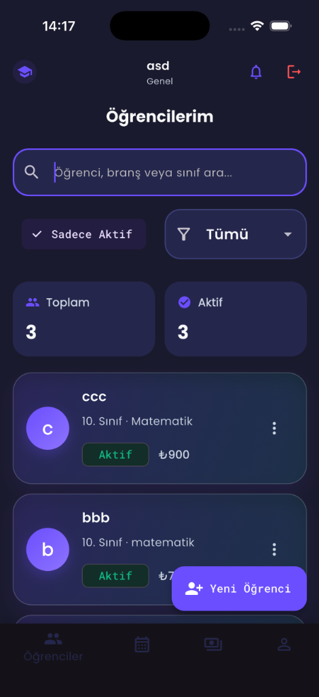
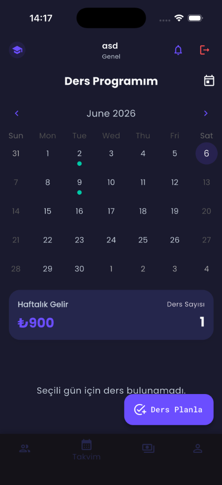
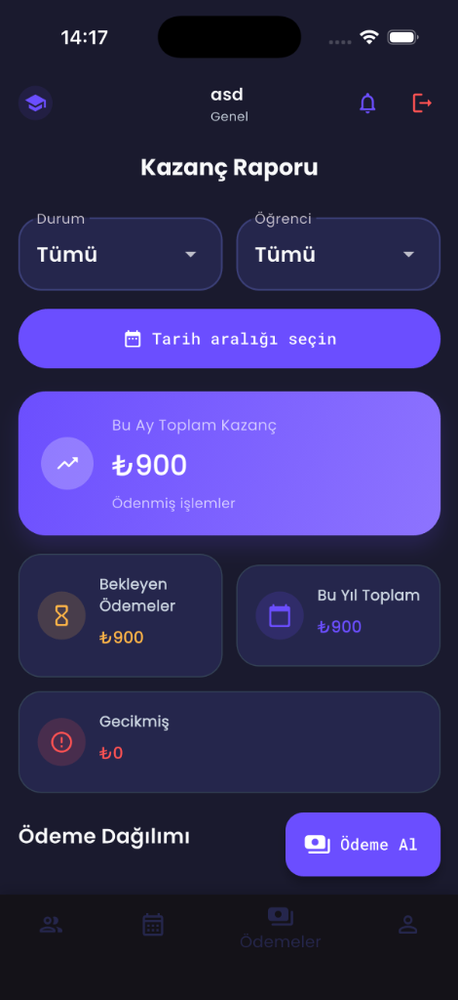
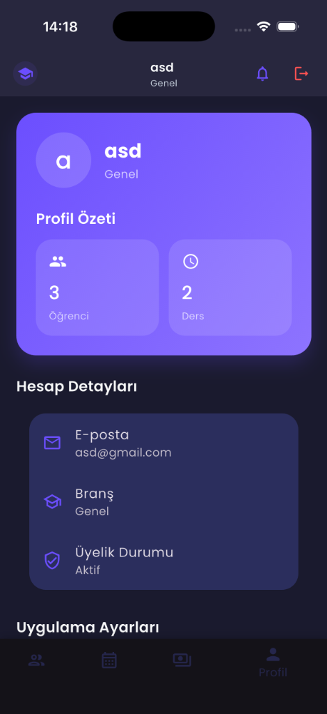

# 📚 DersHub

> Özel ders öğretmenleri için akıllı yönetim uygulaması

DersHub, özel ders veren öğretmenlerin günlük iş yükünü hafifletmek için tasarlanmış **hepsi bir arada** bir mobil uygulamadır. Öğrenci takibi, ders takvimi, ödeme yönetimi ve not tutma gibi tüm ihtiyaçları tek bir çatı altında toplar.

---

## 🎯 Ne İşe Yarar?

Özel ders öğretmenleri genellikle öğrenci bilgilerini, ders programlarını ve ödeme takiplerini farklı araçlarla (Excel, takvim uygulaması, not defteri vb.) yönetir. **DersHub**, bu dağınık süreci merkezi bir platforma taşıyarak öğretmenlerin zamandan tasarruf etmesini ve işlerini daha profesyonel yönetmesini sağlar.

### Uygulamayla neler yapabilirsiniz?

- 👨‍🎓 **Öğrencilerinizi kaydedin ve yönetin** — İsim, sınıf, branş, saat ücreti bilgileriyle öğrenci profilleri oluşturun. Aktif/pasif durumlarını takip edin, arama ve filtreleme ile anında erişin.

- 📅 **Ders programınızı planlayın** — Takvim üzerinde derslerinizi görsel olarak yönetin. Hangi gün, hangi öğrenciyle, hangi konuyu işleyeceğinizi planlayın. Haftalık gelir ve ders sayınızı anlık takip edin.

- 💰 **Ödemelerinizi takip edin** — Ders oluşturduğunuzda otomatik olarak ödeme kaydı oluşturulur. Aylık kazanç raporu, bekleyen ödemeler, gecikmiş ödemeler ve ödeme dağılım grafikleriyle finansal durumunuzu her an görün.

- 📝 **Renkli notlar tutun** — Öğrencilerinize özel veya genel notlar oluşturun. Renk kodlamasıyla notlarınızı kategorize edin, ödev takibi ve ders planlaması yapın.

- 🔔 **Hatırlatmalar alın** — Yaklaşan dersler ve ödeme tarihleri için otomatik bildirimler alarak hiçbir şeyi kaçırmayın.

- 👤 **Profilinizi özelleştirin** — Ad, branş bilgilerinizi düzenleyin; tema (açık/koyu), dil ve bildirim tercihlerinizi yönetin. Verilerinizi CSV olarak dışa aktarın.

---

## 📸 Ekran Görüntüleri

<p align="center">
  
  &nbsp;&nbsp;
  
  &nbsp;&nbsp;
  
  &nbsp;&nbsp;
  
</p>

<p align="center">
  <em>Soldan sağa: Öğrenciler · Takvim · Ödemeler · Profil</em>
</p>

---

## ✨ Özellikler

| Modül | Açıklama |
|---|---|
| 👨‍🎓 **Öğrenci Yönetimi** | Öğrenci ekleme, düzenleme, silme; sınıf ve branş bazlı filtreleme |
| 📅 **Takvim** | Ders planlaması ve takvim görünümü |
| 💰 **Ödeme Takibi** | Ödeme oluşturma, tahsilat, aylık gelir grafikleri |
| 📝 **Notlar** | Öğrenciye özel renkli not kartları |
| 🔔 **Bildirimler** | Ders ve ödeme hatırlatma bildirimleri |
| 🌙 **Karanlık/Aydınlık Tema** | Kullanıcı tercihine göre dinamik tema |
| 🌐 **Çoklu Dil** | Türkçe ve İngilizce destek |
| 🔐 **Firebase Auth** | E-posta/şifre ile güvenli kimlik doğrulama |

---

## 🛠️ Teknoloji Yığını

### Framework & Dil
- **Flutter** `>=3.38.5`
- **Dart** `>=3.10.0`

### State Management
- [flutter_riverpod](https://pub.dev/packages/flutter_riverpod) `^2.6.1` — Reaktif state yönetimi

### Backend & Veritabanı
- [firebase_core](https://pub.dev/packages/firebase_core) `^3.13.1`
- [firebase_auth](https://pub.dev/packages/firebase_auth) `^5.5.4`
- [cloud_firestore](https://pub.dev/packages/cloud_firestore) `^5.6.9`

### UI & Görsel
- [google_fonts](https://pub.dev/packages/google_fonts) `^6.2.1`
- [fl_chart](https://pub.dev/packages/fl_chart) `^0.70.2` — Gelir grafikleri
- [table_calendar](https://pub.dev/packages/table_calendar) `^3.1.3` — Takvim bileşeni
- [flutter_spinkit](https://pub.dev/packages/flutter_spinkit) `^5.2.1` — Yükleme animasyonları

### Bildirimler
- [flutter_local_notifications](https://pub.dev/packages/flutter_local_notifications) `^18.0.1`
- [timezone](https://pub.dev/packages/timezone) `^0.9.4`

### Model & Seri Hale Getirme
- [freezed_annotation](https://pub.dev/packages/freezed_annotation) `^2.4.4`
- [json_annotation](https://pub.dev/packages/json_annotation) `^4.9.0`

### Kod Üretimi (Dev)
- [build_runner](https://pub.dev/packages/build_runner) `^2.4.14`
- [freezed](https://pub.dev/packages/freezed) `^2.5.8`
- [json_serializable](https://pub.dev/packages/json_serializable) `^6.9.4`

---

## 📁 Proje Yapısı

```
lib/
├── main.dart                   # Uygulama giriş noktası
├── firebase_options.dart       # Firebase platform yapılandırması
│
├── core/
│   ├── constants.dart          # Renkler, boyutlar, string sabitleri
│   ├── theme.dart              # Açık/koyu tema tanımları
│   └── helpers.dart            # Yardımcı fonksiyonlar
│
├── models/
│   ├── student.dart            # Öğrenci modeli (Freezed)
│   ├── lesson.dart             # Ders modeli (Freezed)
│   ├── payment.dart            # Ödeme modeli (Freezed)
│   ├── note.dart               # Not modeli
│   └── progress_note.dart      # İlerleme notu modeli
│
├── services/
│   ├── auth_service.dart       # Firebase kimlik doğrulama
│   ├── database_service.dart   # Firestore CRUD işlemleri
│   ├── firestore_service.dart  # Firestore sorgu yardımcısı
│   ├── lesson_service.dart     # Ders iş mantığı
│   ├── notification_service.dart # Yerel bildirimler
│   ├── payment_service.dart    # Ödeme iş mantığı
│   ├── progress_note_service.dart
│   ├── settings_service.dart   # Tema & dil tercihleri
│   └── student_service.dart    # Öğrenci iş mantığı
│
└── features/
    ├── auth/                   # Giriş, kayıt, splash ekranları
    ├── home/                   # Ana sayfa / dashboard
    ├── students/               # Öğrenci listesi ve detay
    ├── calendar/               # Ders takvimi
    ├── payments/               # Ödeme yönetimi
    └── notes/                  # Not defteri
```

---

## 🚀 Kurulum

### Ön Gereksinimler

- [Flutter SDK](https://docs.flutter.dev/get-started/install) `>=3.10`
- [Dart SDK](https://dart.dev/get-dart) `>=3.10`
- [Firebase CLI](https://firebase.google.com/docs/cli)
- Xcode (iOS) veya Android Studio (Android)

### 1. Depoyu Klonla

```bash
git clone https://github.com/kullanici-adi/dershub.git
cd dershub
```

### 2. Bağımlılıkları Yükle

```bash
flutter pub get
```

### 3. Firebase Yapılandırması

```bash
# Firebase CLI ile giriş yap
firebase login

# FlutterFire CLI'yı kur
dart pub global activate flutterfire_cli

# Firebase projesini yapılandır
flutterfire configure
```

> `firebase_options.dart` dosyası bu adımda otomatik oluşturulur.

### 4. Kodu Üret (Freezed Modeller)

```bash
dart run build_runner build --delete-conflicting-outputs
```

### 5. Uygulamayı Çalıştır

```bash
# iOS Simülatörde
flutter run

# Belirli bir cihazda
flutter run -d <device_id>

# Mevcut cihazları listele
flutter devices
```

---

## 🏗️ Derleme (Production)

```bash
# Android APK
flutter build apk --release

# Android App Bundle
flutter build appbundle --release

# iOS
flutter build ipa --release
```

---

## 🔧 Kod Üretimi

Model sınıflarında değişiklik yaptığınızda aşağıdaki komutu çalıştırın:

```bash
# Tek seferlik
dart run build_runner build --delete-conflicting-outputs

# İzleme modunda (geliştirme sırasında)
dart run build_runner watch --delete-conflicting-outputs
```

---

## 🧪 Test

```bash
# Tüm testleri çalıştır
flutter test

# Belirli bir test dosyası
flutter test test/widget_test.dart

# Statik analiz
flutter analyze
```

---

## 📱 Desteklenen Platformlar

| Platform | Durum |
|---|---|
| 📱 iOS | ✅ Destekleniyor |
| 🤖 Android | ✅ Destekleniyor |
| 🌐 Web | ⚠️ Kısmi destek |

---

## 🎨 Tasarım Sistemi

Uygulama, tutarlı bir görsel dil için merkezi bir tasarım sistemi kullanır:

- **Primary:** `#6B4EFF` (Mor)
- **Secondary:** `#00C9A7` (Yeşil-Turkuaz)
- **Accent:** `#FFB547` (Turuncu)
- **Success:** `#10B981`
- **Error:** `#FF5252`
- **Karanlık Arka Plan:** `#1A1A2E`

---

## 📄 Lisans

Bu proje özel kullanım amaçlıdır. Dağıtım hakları saklıdır.

---

<p align="center">
  Geliştirici: <strong>Saliha Karaman</strong> &nbsp;•&nbsp; Flutter ile ❤️ yapıldı
</p>
